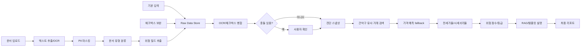

# Final Architecture

```mermaid
flowchart LR
  A["기본 입력"] --> B["Raw Data Store"]
  C["문서 업로드"] --> D["텍스트 추출/OCR"]
  D --> E["PII 마스킹"]
  E --> F["문서 유형 분류"]
  F --> G["위험 필드 추출"]
  H["체크박스 보완"] --> B
  G --> B
  B --> I["OCR/체크박스 병합"]
  I --> J{"충돌 있음?"}
  J -->|예| K["사용자 확인"]
  J -->|아니오| L["진단 스냅샷"]
  K --> L
  L --> M["관악구 유사 거래 검색"]
  M --> N["가격 예측 fallback"]
  N --> O["전세가율/시세괴리율"]
  O --> P["위험 점수/등급"]
  P --> Q["RAG/템플릿 설명"]
  Q --> R["최종 리포트"]
```

핵심은 OCR 정확도보다 입력 안정화입니다. OCR 결과, 체크박스, 사용자 입력, 공공데이터를 모두 원본 출처별로 저장하고 충돌을 감지한 뒤 스냅샷으로 고정합니다.
